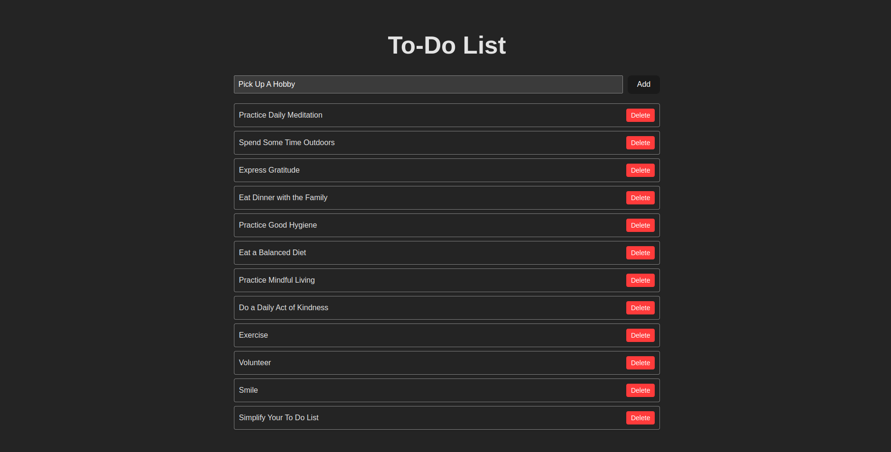

# To-Do List App

## Overview

This is a simple to-do list application created with React. It allows users to manage their tasks effectively. You can add new tasks, mark them as completed, and remove them when you're done.

## Project Structure

The project structure is organized as follows:

- `src/`: This directory contains the source code for the application.

  - `App.js`: The main component that renders the entire application.
  - `components/`: This directory contains the reusable components used throughout the app.
  - `data/`: Contains the sample data used to populate the initial to-do list.
  - `styles/`: Contains the CSS files for styling the app.

## Features

- **Add Tasks**: You can add new tasks to the list by entering a task description and clicking the "Add" button.

- **Remove Tasks**: Remove tasks from the list by clicking the "Delete" button next to each task.

## Prints
<p align="center">
  
</p>

## Prerequisites

Before you begin, ensure you have met the following requirements:

- [Node.js](https://nodejs.org/): You need Node.js to run the application. It includes npm (Node Package Manager) for managing dependencies.

## Getting Started

To get the application up and running, follow these steps:

### Installation

1. Clone this repository to your local machine:

   ```bash
   git clone https://github.com/your-username/todo-list-app.git
   ```

2. Install the project dependencies using npm:

   ```bash
   npm install
   ```

### Running the App

Once you've installed the dependencies, you can start the application with the following command:

```bash
npm start
```

This will launch the application in your default web browser. You can now add, complete, and remove tasks as needed.

## License

This project is licensed under the [MIT License](LICENSE.md).
